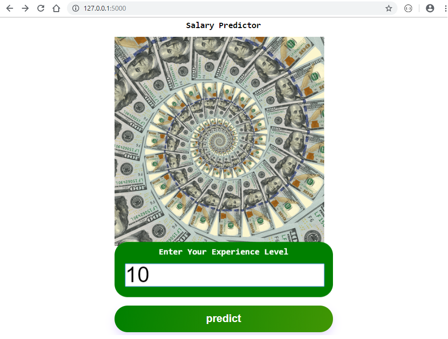

# App--SalaryPredictor

#

#

## Background
Web-app that recieve a input text and return text in Json format, WordCloud Image as well in a API

## Goals

Extract a user input in text format
Use library such spicy and textblob to find the keys and sort
Create WordCloud visualization and string to return
Create a back-end with Flask
Create a Front-end with Bootstrap

## Run Locally
Run this command git clone https://github.com/meuwebsite/AppNLPiffy/

Make sure you have installed in your computer all libraries used above

Double check if you are in the right directory in you terminal ...that often cause errors

Terminal Should be addressed at folder: flask_app

Run the command in your terminal: python app.py

Copy the output link and paste in your Browser

You are now in the dev environment and you can play around

