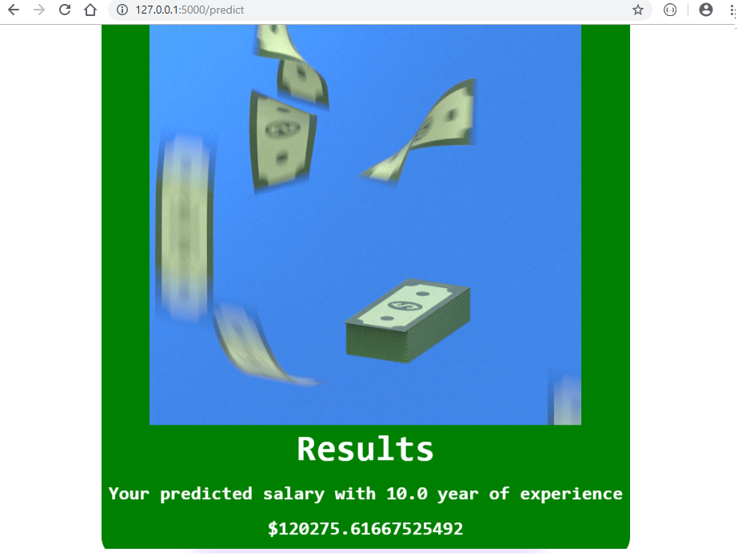

# App--SalaryPredictor

#

#

## Background
Web-app that takes the JSON data while POST request an performs the prediction using loaded model and returns
the results in JSON format.

## Goals

* Create a Front-end with Bootstrap
* Extract a user input in text format
* Use Sklearn library to import and apply Linear Regression on the data set
* Train and Test the model
* Save the model into Pickle file
* Create a back-end with Flask
* Create a route to Run the input in the model
* Return the predicted salary based on years of experience

## Run Locally
Run this command git clone https://github.com/meuwebsite/AppNLPiffy/

Make sure you have installed in your computer all libraries used above

Double check if you are in the right directory in you terminal ...that often cause errors

Terminal Should be addressed at folder: flask_app

Run the command in your terminal: python app.py

Copy the output link and paste in your Browser

You are now in the dev environment and you can play around

